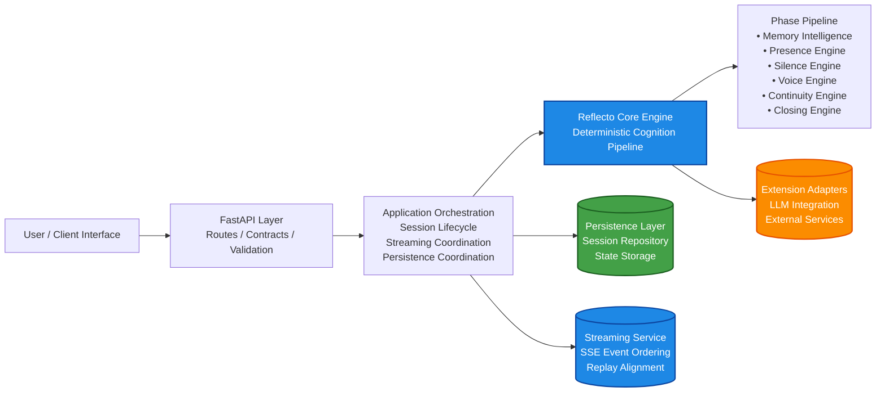

# Reflecto

Reflecto is a deterministic, phase-driven reflective intelligence system
designed to separate cognition logic from infrastructure and
probabilistic AI components.

The platform focuses on building reproducible, testable, and modular
reflective intelligence workflows suitable for secure and
mission‑critical environments.

------------------------------------------------------------------------

## Architecture Diagram

------------------------------------------------------------------------

## Overview

Reflecto provides a structured cognition engine that processes
reflection sessions through defined phases while maintaining
deterministic behavior and strong architectural separation.

The system supports:

• Reflection session orchestration\
• Identity and pattern evolution\
• Deterministic cognition pipelines\
• Streaming and persistence coordination\
• AI/LLM integration through adapter extensions

------------------------------------------------------------------------

## Architecture

Reflecto follows Clean Architecture and Domain‑Driven Design principles.

User / Client → API Layer → Application Orchestration → Core Reflecto
Engine → Persistence / Streaming / Extensions

------------------------------------------------------------------------

## Project Structure

reflecto/ → Core cognition engine (pure, deterministic, fully tested)\
extensions/ → Optional adapters (LLMs, external APIs)\
api/ → FastAPI service layer and route orchestration\
persistence/ → Session storage and repository logic\
app/ → Runnable entrypoints and deployment runners\
tests/ → Phase‑based behavioral test specifications\
doc/ → Architecture and module documentation

------------------------------------------------------------------------

## Design Philosophy

### Deterministic Domain Engine

The cognition core remains: • Fully testable\
• Infrastructure independent\
• Reproducible across runs

### Application Layer Orchestration

Responsible for: • Session lifecycle management\
• Streaming coordination\
• Persistence orchestration

### Extension Adapters

Used only for: • LLM integrations\
• External service communication\
• Non‑deterministic augmentation

------------------------------------------------------------------------

## Guarantees

• Core cognition remains deterministic\
• Behavior is fully test‑driven\
• Extensions cannot modify domain logic\
• Replay integrity is preserved\
• Streaming events remain ordered and deterministic

------------------------------------------------------------------------

## Quick Start

### Clone Repository

    git clone https://github.com/aquevedo-git/reflecto.git
    cd reflecto

### Create Virtual Environment

    python -m venv venv
    source venv/bin/activate

### Install Dependencies

    pip install -r requirements.txt

------------------------------------------------------------------------

## Running Tests

    pytest

------------------------------------------------------------------------

## Running the API

    uvicorn api.main:app --reload

API: http://localhost:8000\
Swagger: http://localhost:8000/docs

------------------------------------------------------------------------

## Continuous Integration

Reflecto uses GitHub Actions to validate:

• Dependency installation\
• Import reliability\
• Behavioral testing\
• Environment reproducibility

------------------------------------------------------------------------

## Current Status

v1.0 Core Locked

------------------------------------------------------------------------

## Roadmap

### Phase 1

✔ Deterministic reflection engine\
✔ Session orchestration pipeline\
✔ Streaming lifecycle integration\
✔ Identity and pattern evolution\
✔ CI/CD pipeline

### Phase 2

⬜ Advanced multi‑session continuity\
⬜ Distributed streaming support\
⬜ Extended adapter ecosystem

### Phase 3

⬜ Multi‑agent reflective cognition\
⬜ Real‑time adaptive identity modeling\
⬜ AI‑assisted behavioral forecasting

------------------------------------------------------------------------

## Use Cases

• Reflective AI assistants\
• Secure cognition pipelines\
• Behavioral analytics systems\
• Personal intelligence platforms\
• AI experimentation frameworks\
• Defense and mission analytics workflows

------------------------------------------------------------------------

## Author

Arturo Quevedo\
Data Engineer / AI Systems Developer

LinkedIn: https://linkedin.com/in/art-quevedo

------------------------------------------------------------------------

## License

Apache 2.0 License
